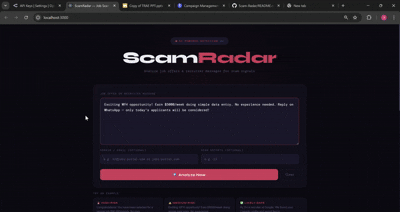

# 🛡️ ScamRadar — AI-Powered Job Scam Detection System

A production-ready full-stack application designed to detect fraudulent job offers using advanced AI analysis.
The system evaluates job messages, identifies scam indicators, and provides actionable risk insights.

---

## 🚀 Overview

ScamRadar helps users:

* Detect suspicious job offers
* Understand risk factors
* Make informed decisions before applying

The system leverages structured AI analysis to convert unstructured job messages into meaningful risk scores and recommendations.

---


## 🏗️ Tech Stack

* **Frontend:** React 18 (Modular + Component-based UI)
* **Backend:** Node.js + Express (REST API)
* **AI Integration:** Google Gemini (LLM-based analysis)
* **Architecture:** Client–Server (Decoupled Frontend & Backend)

---


## 📁 Project Structure

```
JobScanX/
├── backend/
│   ├── main.py                  
│   ├── fake_job_postings.csv   
│   ├── requirements.txt        
│   ├── server.js               
│   ├── package.json
│   └── .env
│
├── frontend/
│   ├── public/                 
│   ├── src/                    
│   ├── package.json
│   └── .env
│
├── .gitignore
└── README.md
```


## ⚙️ Local Setup

### 1. Backend

```bash
cd backend
# install python dependencies
pip install -r requirements.txt

# run backend server
uvicorn main:app --reload

👉 Backend will run on:
http://127.0.0.1:8000
```

---

### 2. Frontend

```bash
cd frontend
npm install
npm start
```

---

## 🔌 API Design

### `POST /analyze`

Analyzes a job message and returns structured scam insights.

**Input:**

```json
{
  "message": "Earn ₹80,000/month. Limited seats. Apply now!",
  "domain": "jobs@gmail.com",
  "reportCount": "15"
}
```

**Output:**

```json
{
  "success": true,
  "data": {
    "scam_score": 85,
    "risk_level": "High",
    "summary": "Strong scam indicators detected",
    "reasons": ["Urgency language", "Unverified domain"],
    "trust_breakdown": {
      "salary_risk": 80,
      "tone_risk": 90,
      "domain_risk": 75,
      "payment_risk": 95
    },
    "final_advice": {
      "decision": "Avoid"
    }
  }
}
```

---

### `GET /health`

Health check endpoint to verify server status.

```json
{ "status": "ok" }
```

---

## 🎯 Core Features

* AI-powered scam detection (0–100 risk scoring)
* Multi-factor risk breakdown (salary, tone, domain, payment)
* Detection of suspicious patterns and phrases
* Structured decision output (Apply / Caution / Avoid)
* Clean and interactive frontend visualization
* Modular and scalable architecture

---

## ⚙️ Detection Logic (High-Level)

The system evaluates:

* Payment requests and upfront fees
* Urgency and pressure tactics
* Email/domain credibility
* Unrealistic salary promises
* Missing or unverifiable company information
* Community-reported signals

These factors are aggregated into a normalized risk score.

---

## 🔒 Security & Configuration

* Sensitive configuration is managed via environment variables
* `.env` files are excluded from version control
* `.env.example` provides required variable references

---

## 🧠 System Flow

1. User submits job message
2. Backend processes request
3. AI model analyzes scam indicators
4. Structured JSON response is generated
5. Frontend visualizes results

---
## 🎥 Demo


## 🚀 Future Scope

* Browser Extension (Gmail / LinkedIn scanning)
* Real-time scam database integration
* Domain reputation & WHOIS analysis
* User reporting and feedback loop

---

## 👩‍💻 Authors
**Anshika Bhatt**
**Stuti Sharma**


---

## ⭐ Project Value

This project demonstrates:

* Real-world AI integration in web applications
* Full-stack system design
* Practical cybersecurity use-case implementation
* Scalable and modular architecture

---
